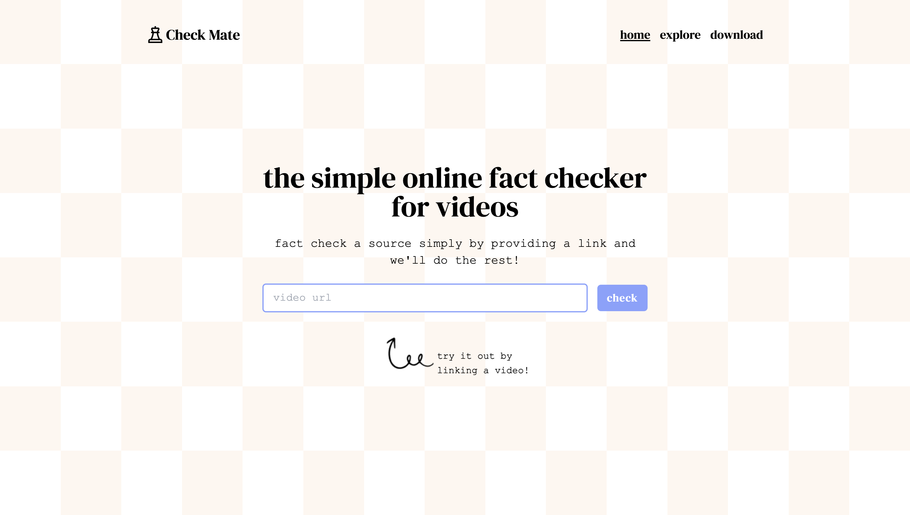

# Check Mate

## Inspiration
With the rise of short-form media, misinformation is spreading faster than ever. We were inspired to create a solution that could help users quickly verify the truth behind viral videos. Our goal was to build a tool that leverages advanced technology to limit or end the spread of false information, which can be particularly dangerous in today's world, where content consumption is increasingly bite-sized and attention spans are growing shorter.

## What it does
**Check Mate** is a web app that verifies short-form media content by cross-referencing it with reliable sources. Users simply input a URL, and the app uses multiple open-source large language models (LLMs) to analyze the video content, compare sentence embeddings, and authenticate, rebut, or question the validity of the claims made in the media. The app provides a clear, user-friendly result to help users determine whether the content is trustworthy.

## How we built it
We built **Check Mate** using React for the frontend, Flask for our REST API, and integrated advanced open-source LLMs with Groq for data validation. To streamline development and enhance user experience, we utilized generative UI, which allowed us to accelerate production while creating a highly intuitive interface. A key part of our solution was leveraging sentence embeddings to analyze video transcripts and cross-reference them with reputable sources. By incorporating multiple open-source LLMs, we ensured thorough and accurate validation. With a focus on scalability and efficiency, Check Mate seamlessly verifies media content and delivers results to users in real time.

## Challenges we ran into
One of the biggest challenges we faced was integrating multiple open-source LLMs and ensuring they worked together to provide accurate verification. Processing and comparing sentence embeddings was another complex task. We also had to carefully balance efficiency with accuracy, especially when handling the wide variety of information from viral media.

## Accomplishments that we're proud of
We are proud of building something helpful for our community, overcoming challenges with LLMs, networking with other talented individuals, working in a fast-paced environment, and learning new technologies to turn an idea into reality. We are also excited about our fun and visually intuitive interface, which makes it easy for users to verify content in just a few clicks.

## What we learned
Through this project, we learned how to effectively work with large language models and utilize the power of sentence embeddings to create a functional and efficient tool. We also gained valuable experience in optimizing backend processes and improving the user interface to ensure a smooth user experience.

## What's next for **Check Mate**
We're looking at ways to improve the user interface and introduce more features, such as real-time verification for live media. Additionally, we plan to implement a browser extension to make the validation process quicker and easier. Beyond short-form media, we aim to expand **Check Mate** to verify all kinds of visual and audio content. We also plan to incorporate more data sources and expand our LLM capabilities for better accuracy. Our ultimate goal is to evolve the platform to combat misinformation across all media formats and promote the spread of truthful content.

